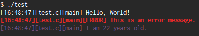

# Display

Lightweight C shared library for tracing to console.


## Features

* Simple backtrace (Display prints out the time, the file, and the function from which it was called)
* Colorful! Specify and use different colors for different situations (errors, warnings, etc.)
* Uses macros to make initialization easier.
* Build documentation with Doxygen.
* Silence process output with `--silent` flag (except for errors and warnings).
* Remove all color output with `--no-color` flag.
* And more (check out the docs)!


## Minimal example process using Display

```C
#include "Display.h"

int main(int argc, char *argv[])
{
    InitializeDisplay(argc, argv);  // call this before any other calls to Display

    Display("Hello, %s!", "World");
    DisplayError("This is an error message.");
    DisplayColor(MAGENTA, "I am %d years old.", 22);

    CloseDisplay();  // clean up
    return 0;
}
```

If this file is called 'test.c' and lies in the repo root, next to 'libdisplay.so', it can be compiled like so:

```shell
gcc test.c -o test -I./src -L. -Wl,-rpath=. -ldisplay
```

Then, running `./test` results in the following terminal output:




Check out the full feature demo file in the demo/ directory. Build it from the command line with `make`.


## Documentation

Documentation uses Doxygen. Install Doxygen on Linux like so:

    sudo apt install python-pydot python-pydot-ng graphviz doxygen

Once installed, build the documentation:

    cd docs
    make

The built documentation index is placed at 'docs/html/index.html'. Open this in your default web browser.
